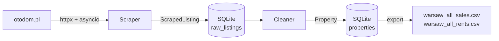

# Warsaw Properties

Async pipeline that scrapes real-estate listings from otodom.pl, persists them
to SQLite, cleans the raw text into typed rows, and exports analysis-ready
CSVs. Covers all eighteen Warsaw districts for both sales and rentals.

## Architecture



* **Scraper** (`src/scraper/`) – async httpx client with bounded concurrency,
  tenacity retry on 5xx/429, BeautifulSoup-based pure-function parsers.
* **Storage** (`src/storage/`) – SQLAlchemy repository over SQLite. Idempotent
  upserts keyed on otodom listing id. Two tables: raw scraped strings and
  cleaned typed rows.
* **Cleaner** (`src/cleaner/`) – vectorised pandas transformations (string
  ops, not `.apply` per row). Pulls raw rows from SQLite, writes typed rows
  back.
* **Models** (`src/models/`) – two pydantic models: `ScrapedListing` (raw
  strings, lenient) and `Property` (typed, frozen).
* **CLI** (`src/cli.py`) – typer interface with `scrape`, `clean`, `export`.
* **Config** (`src/config.py`) – pydantic-settings loaded from `.env`,
  prefixed `WP_`.

### Design choices

* SQLite as single source of truth – CSV is a downstream export, not a
  primary store. Lets the pipeline upsert, resume, and join across runs.
* Separate `ScrapedListing` from `Property` – the scraper stays stable when
  the cleaner schema changes, and vice versa. Raw rows give a permanent audit
  trail.
* Async over threadpool – `asyncio.Semaphore` gives explicit concurrency
  control and pairs naturally with `httpx.AsyncClient` keep-alive.
* Listing id derived from otodom URL (not random) – upserts are idempotent
  and `--resume` is cheap.

## Quick start

```bash
uv sync
cp .env.example .env  # optional, defaults work out of the box

# Scrape all districts (sale + rent), persist to SQLite
uv run python -m src scrape

# Or a single district
uv run python -m src scrape -d SRODMIESCIE -t SALE --max 200

# Resume after interruption — skips ids already in the DB
uv run python -m src scrape --resume

# Clean raw rows into typed properties
uv run python -m src clean

# Export typed rows to CSV
uv run python -m src export SALE -o warsaw_all_sales.csv
uv run python -m src export RENT -o warsaw_all_rents.csv
```

## Configuration

All settings are environment variables prefixed with `WP_`. See
[`.env.example`](.env.example) for the full list. Common ones:

| Variable | Default | Purpose |
| --- | --- | --- |
| `WP_DATABASE_URL` | `sqlite:///./data/properties.db` | SQLAlchemy URL |
| `WP_HTTP_MAX_CONCURRENT` | `5` | Concurrent in-flight HTTP requests |
| `WP_HTTP_MAX_ATTEMPTS` | `4` | Retry budget for transient errors |
| `WP_MAX_PROPERTIES_PER_COMBINATION` | `500` | Hard cap per district x type |
| `WP_DELAY_SECONDS_BETWEEN_COMBINATIONS` | `10` | Politeness delay |

## Docker

```bash
docker compose run --rm scraper scrape --resume
docker compose run --rm scraper clean
docker compose run --rm scraper export SALE -o /data/warsaw_all_sales.csv
```

The SQLite database and exported CSVs live in the mounted `./data` volume.

## Project layout

```
src/
├── cli.py                CLI entry (typer)
├── config.py             pydantic-settings
├── cleaner/
│   ├── batch_cleaner.py  Orchestration across listing types
│   └── property_cleaner.py
├── models/
│   ├── property.py       ScrapedListing + Property + listing-id helper
│   └── types.py          District / ListingType / ResultLimit enums
├── scraper/
│   ├── batch_scraper.py
│   ├── http_client.py    AsyncHttpClient + tenacity retry
│   ├── parser.py         Pure HTML → dict
│   ├── property_scraper.py
│   ├── search_params.py  URL builder
│   └── config.py         HTTP headers + Polish label mappings
└── storage/
    ├── models.py         SQLAlchemy tables
    └── repository.py     PropertyRepository
```

## Etyka

Respektuje `robots.txt` i Terms of Service otodom.pl. Domyślny limit
współbieżności (5) i 10-sekundowa pauza między dzielnicami są dobrane tak,
żeby ruch z tego skrypta wyglądał jak ruch jednego użytkownika
przeglądającego serwis. Dane są pobierane do nauki, nie do redystrybucji.

## Stack

Python 3.13 · httpx · asyncio · BeautifulSoup4 · pandas · pydantic v2 ·
pydantic-settings · SQLAlchemy 2 · tenacity · typer · uv · ruff.
